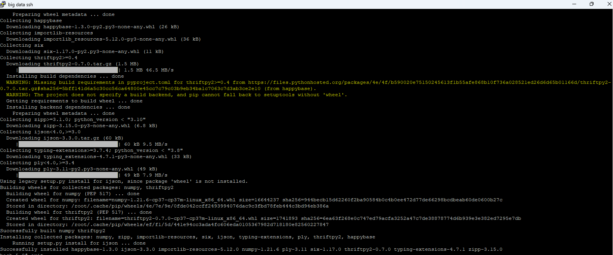
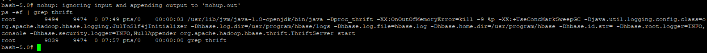

# Project Summary

## Implementation Overview

This project implements an end-to-end distributed data pipeline for a loan approval dataset using Apache NiFi, HDFS, Apache Hive, Apache Spark MLlib, YARN, and Apache HBase.

The pipeline follows this architecture:

**Source Data → NiFi → HDFS → Hive → Spark MLlib → HBase**

Apache NiFi retrieves the source dataset and ingests it into HDFS. Hive provides a structured SQL layer over the ingested data through the `loan_approval` managed table. Apache Spark reads the data from Hive, prepares the selected features, and trains a Logistic Regression classification model using Spark MLlib. The Spark application is submitted to the distributed environment through YARN. After model evaluation, the resulting performance metrics are written to the `loan_model_metrics` HBase table through HappyBase and the HBase Thrift server.

The project demonstrates how distributed data ingestion, storage, SQL, machine learning, resource management, and NoSQL technologies can be integrated into a single workflow.

## Dataset

**Dataset name:** Loan Approval Prediction  
**GitHub direct URL:** https://raw.githubusercontent.com/determination2000cv/dsc650-loan-approval-pipeline/main/sample-data/Loan%20Approval%20Prediction.csv

The dataset contains loan application records with applicant demographic and financial information such as income, loan amount, credit history, education, employment status, property area, and loan approval status.

The dataset is appropriate for this project because `loan_status` provides a binary outcome that can be modeled with Spark MLlib using Logistic Regression. The selected predictor variables include applicant income, co-applicant income, loan amount, loan term, and credit history.

## Environment Setup

The project required additional Python libraries and an HBase communication service to support the Spark MLlib and HBase stages of the pipeline.

`numpy` provides numerical-processing functionality used by Python-based analytical and machine-learning components. The package was installed on the cluster nodes so that the required numerical dependencies were available during distributed execution.

`happybase` provides the Python interface used by the PySpark application to communicate with HBase. It allows the application to connect to the HBase table and write the model evaluation metrics after the machine-learning workflow completes.

HappyBase communicates with HBase through the Thrift protocol. Therefore, the HBase Thrift server must be running before the PySpark application attempts to persist the model metrics. The Thrift server provides the communication layer between the Python application and HBase.

The required Python packages were installed on the master and both worker nodes so that the dependencies were available throughout the distributed Spark environment.

### Package Installation Evidence

### HBase Thrift Server Evidence

## What Worked

The complete pipeline executed successfully from data ingestion through model-metric persistence.

Apache NiFi successfully retrieved the Loan Approval Prediction dataset from GitHub and wrote it into HDFS. The resulting HDFS file was verified at `/data/loan_approval/loan_approval.csv` with a file size of 38,013 bytes.

A managed Hive table named `loan_approval` was created and populated from the ingested dataset. Hive validation queries confirmed that the table contained 614 records, and additional queries were used to inspect sample records and aggregate loan applications by approval status.

The PySpark application successfully read the project data from Hive and prepared the selected numeric attributes for machine learning. Spark MLlib trained a Logistic Regression model, and the training output confirmed that the optimization process converged successfully.

The Spark application executed through YARN. The YARN application listing reported the `LoanApprovalML` Spark application as `FINISHED`, `SUCCEEDED`, and `100%` complete. Spark tasks were distributed across the worker nodes during execution.

Finally, Spark successfully wrote the model evaluation metrics to HBase. A scan performed before Spark execution showed that the `loan_model_metrics` table contained zero rows. After Spark completed, a second scan returned one row containing all five expected model-performance metrics.

## Issues & Challenges Encountered

One of the most significant challenges occurred during NiFi ingestion. The source GitHub URL contained an encoded space (`%20`), but NiFi encoded the percent sign again, resulting in `%2520`. This caused the HTTP request to return a 404 response instead of the dataset.

The issue was investigated by inspecting the FlowFile attributes and comparing the URL generated by NiFi with the same URL tested successfully through `curl`. The problem was corrected by using literal spaces in the NiFi parameter so that InvokeHTTP performed the encoding only once. After this change, NiFi successfully downloaded the 37.12 KB CSV file.

Another challenge involved coordinating multiple distributed services and their dependencies. Spark, Hive, HDFS, HBase, YARN, HappyBase, and the HBase Thrift server all had to be available and correctly configured for the end-to-end workflow to succeed. The required Python dependencies were installed on the master and worker nodes, and the HBase Thrift server had to be running before the Python application could communicate with HBase.

The project also reinforced the importance of executing commands in the correct environment. Hive SQL commands must be entered from the Hive shell rather than the Linux Bash prompt, while HBase commands must be executed from the HBase shell. Working across several shells and containers required careful attention to the current execution context.

## Results

The project successfully moved the Loan Approval Prediction dataset through the complete distributed pipeline:

**NiFi → HDFS → Hive → Spark MLlib/YARN → HBase**

Hive validation confirmed that the `loan_approval` table contained **614 records**.

A Spark MLlib Logistic Regression model was trained using the following predictor variables:

- `applicant_income`
- `coapplicant_income`
- `loan_amount`
- `loan_amount_term`
- `credit_history`

The binary target was derived from `loan_status`.

The final model evaluation results were:

| Metric | Result |
|---|---:|
| Accuracy | 0.8533 |
| Precision | 0.8554 |
| Recall | 0.8533 |
| F1 Score | 0.8393 |
| AUC | 0.7062 |

The model achieved approximately 85.33% classification accuracy on the test data. Precision and recall were also approximately 85%, while the F1 score was approximately 83.93%. The AUC of approximately 0.7062 indicates that the model had useful, though not perfect, ability to distinguish between approved and non-approved loan applications.

After evaluation, Spark wrote all five metrics into the HBase `loan_model_metrics` table under the row key `logistic_regression_run1`. The populated HBase scan verified that the stored values matched the metrics produced by Spark.

## Lessons Learned

The most important lesson from this project was that building a distributed data pipeline involves more than getting each individual technology to work independently. The interfaces between the technologies are equally important.

NiFi had to deliver the data correctly to HDFS before Hive could use it. Hive had to expose the data in a form that Spark could query. Spark required the appropriate dependencies and YARN resources to execute across the cluster. HappyBase required the HBase Thrift server to communicate with HBase. A failure at any one of these integration points could prevent the complete pipeline from succeeding.

The project also demonstrated the value of validating each stage independently. Checking the HDFS file, querying the Hive table, confirming Spark training and evaluation, checking the YARN application status, and comparing the empty and populated HBase scans made it possible to verify the pipeline incrementally rather than troubleshooting the entire architecture at once.

## Production Considerations

A production implementation would require additional controls beyond those used in this course environment.

Security and authentication would need to be strengthened across the platform, including controlled service accounts, encrypted communications, authorization policies, and secure secrets management rather than embedding sensitive configuration in application code.

High availability and fault tolerance would also be important. Production Hadoop, HBase, and supporting services would typically use redundant nodes and appropriately configured recovery mechanisms to reduce dependence on individual services or machines.

Centralized observability should be implemented for NiFi, HDFS, Hive, Spark, YARN, and HBase. Application and infrastructure metrics, logs, alerts, data-quality checks, and pipeline-failure notifications would make operational problems easier to identify and resolve.

Resource sizing would need to reflect actual production data volumes and workload requirements. Spark executor memory, CPU allocation, partitioning, HDFS storage, and HBase capacity should be sized and monitored based on workload characteristics rather than the constraints of a course virtual environment.

The pipeline should also be automated through scheduled orchestration and CI/CD processes rather than relying on manual commands. Version-controlled deployment, automated testing, data-quality validation, and environment-specific configuration would improve reliability and repeatability.

Finally, a production implementation should include formal data-governance practices such as data ownership, lineage, metadata management, retention requirements, access controls, and monitoring of model and data quality as the underlying source data changes over time.
