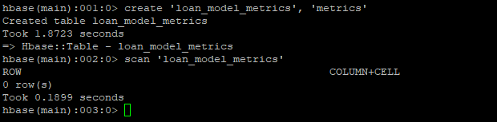
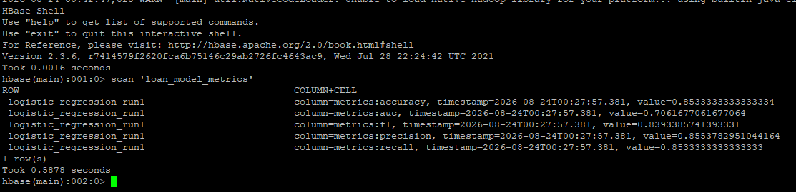

# Apache HBase — Model Metrics Persistence

## Role in the Pipeline

Apache HBase provides the NoSQL persistence layer for the machine learning metrics generated by Spark MLlib.

The HBase table is created before the Spark job runs, verified with an empty scan, populated by the PySpark application, and scanned again after execution to confirm that the model-performance metrics were successfully stored.

## Table Design

**Table name:** `loan_model_metrics`  
**Row key:** `logistic_regression_run1`  
**Column family/families:** `metrics`

The `loan_model_metrics` table stores the evaluation results produced by the Loan Approval Prediction model. The row key `logistic_regression_run1` identifies the specific model execution and keeps all evaluation metrics from that run together.

The `metrics` column family groups the model-performance measurements generated by Spark MLlib. This structure allows multiple related metrics to be stored under a single model-run identifier and provides flexibility to add additional evaluation metrics in future model executions.

## HBase Commands

The commands used to create and inspect the table are stored in:

[`commands.txt`](commands.txt)

## Empty Table Verification

The `loan_model_metrics` table was created before the Spark MLlib application was executed. An initial scan of the table returned `0 row(s)`, confirming that the table existed but contained no model-performance data before Spark ran.

This establishes a baseline that allows the later populated scan to demonstrate that the metrics were written by the Spark application.

## Metrics Written by Spark

The Spark MLlib application wrote five Logistic Regression evaluation metrics into the `metrics` column family:

| Metric | Value |
|---|---:|
| Accuracy | 0.8533333333333334 |
| Precision | 0.8553782951044164 |
| Recall | 0.8533333333333333 |
| F1 Score | 0.8393385741393331 |
| AUC | 0.7061677061677064 |

These values represent the performance of the Logistic Regression model on the test portion of the Loan Approval Prediction dataset. Accuracy measures the overall proportion of correct predictions. Precision, recall, and F1 provide additional measures of classification performance, while AUC measures the model's ability to distinguish between approved and non-approved loan applications across classification thresholds.

The PySpark application connects to HBase using `happybase` through the HBase Thrift server and stores these values under the `logistic_regression_run1` row key.

## Populated Table Verification

After the Spark MLlib application completed, a second scan of `loan_model_metrics` returned `1 row(s)`. The row `logistic_regression_run1` contained all five expected columns: `metrics:accuracy`, `metrics:precision`, `metrics:recall`, `metrics:f1`, and `metrics:auc`.

The values displayed by HBase match the evaluation metrics generated during the Spark execution. This confirms that Spark successfully persisted the model-performance results into HBase.

This final scan provides end-to-end verification that the pipeline successfully moved from ingestion and distributed storage through SQL access, machine learning, and persistent NoSQL results.
