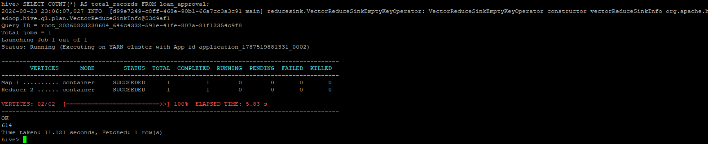
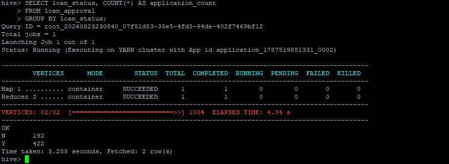

# Apache Hive — Managed Table & SQL Validation

## Role in the Pipeline

Apache Hive provides the structured SQL layer between HDFS storage and the Spark MLlib workload. The project data loaded through NiFi into HDFS is used to create and populate a Hive-managed table.

## Hive Table Design

**Table name:** `loan_approval`

The `loan_approval` managed table represents the Loan Approval Prediction dataset and contains 13 columns describing loan applications. String data types are used for categorical fields such as `gender`, `married`, `education`, `self_employed`, `property_area`, and `loan_status`. `applicant_income` is stored as an integer, while `coapplicant_income`, `loan_amount`, `loan_amount_term`, and `credit_history` use numeric data types that accommodate decimal values and missing values.

The table uses comma-delimited text storage and skips the CSV header row during processing. This schema provides a structured representation of the source data that can be queried with Hive and used as input for downstream Spark MLlib processing.

## SQL Files

- [`create_tables.sql`](create_tables.sql) — table creation and data-loading SQL
- [`queries.sql`](queries.sql) — validation, exploration, and aggregation queries

## Data Load Verification

The dataset was loaded from HDFS into the `loan_approval` managed Hive table using `LOAD DATA INPATH`. A record-count query was then executed to verify that the table was successfully populated. The query returned **614 records**, confirming that the dataset was available through Hive.

## Query & Aggregation Verification

Representative queries were used to validate the populated table and confirm that the dataset fields were interpreted correctly. A `COUNT(*)` query verified the total number of records, and an aggregation grouped the records by `loan_status` to summarize the number of applications by approval outcome. A sample-record query was also used to verify that the source columns aligned correctly with the Hive table schema.

These results demonstrate that the managed table is populated, queryable, and structured correctly for downstream processing.

The validated Hive table becomes the structured input used by the PySpark MLlib application.
