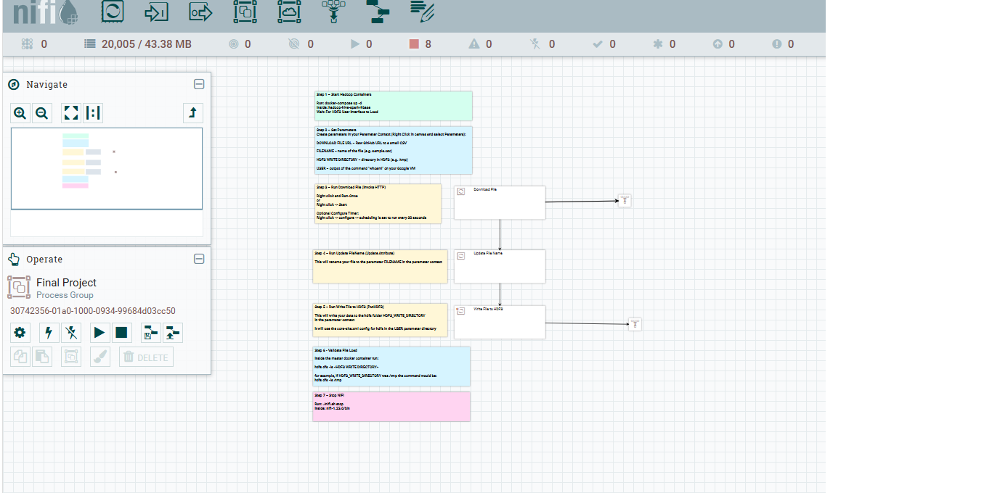
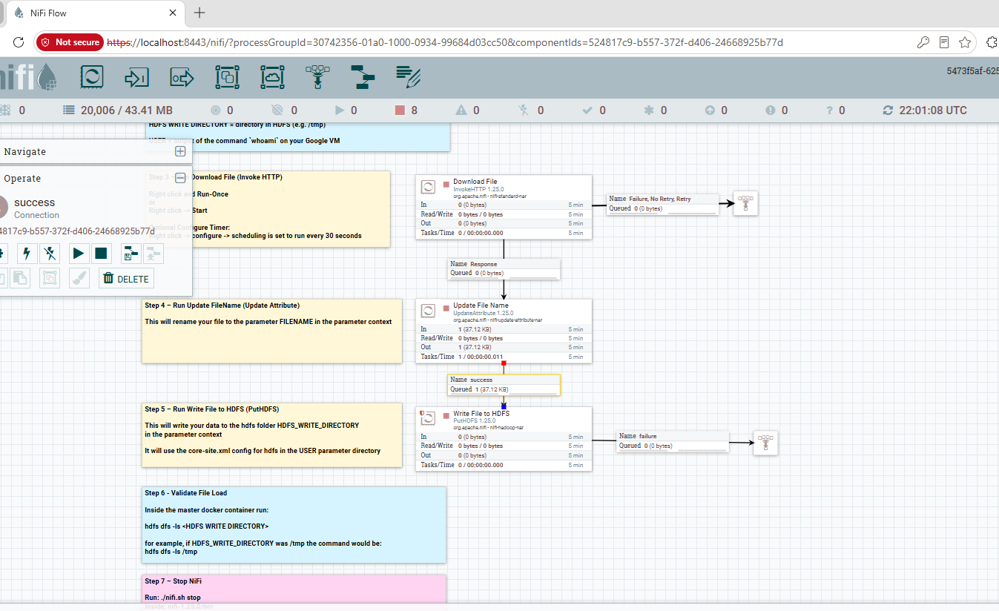
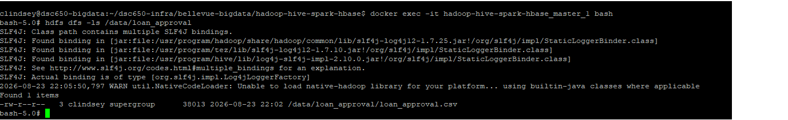

# Apache NiFi — Data Ingestion into HDFS

## Role in the Pipeline

Apache NiFi provides the ingestion and orchestration layer for this project. The completed flow retrieves the project dataset and writes it into HDFS for downstream processing.

## Source Dataset

**Dataset:** Loan Approval Prediction  
**GitHub direct URL:**  https://raw.githubusercontent.com/determination2000cv/dsc650-loan-approval-pipeline/main/sample-data/Loan%20Approval%20Prediction.csv

The dataset contains loan application records with applicant demographic and financial information such as income, loan amount, credit history, education, employment status, property area, and loan approval status. It was selected because it supports a clear binary classification problem for the Spark MLlib portion of the project.

## Flow Design

The final NiFi flow uses the following processors:

| Processor / Process Group | Role in the Flow |
|---|---|
| Download File | Uses InvokeHTTP to retrieve the Loan Approval Prediction CSV file from the GitHub raw URL. |
| Update File Name | Uses UpdateAttribute to rename the downloaded FlowFile to `loan_approval.csv`. |
| Write File to HDFS | Uses PutHDFS to write the renamed CSV file into the configured HDFS directory. |

Data moves from the GitHub raw URL into NiFi through the Download File processor, is renamed by Update File Name, and is then written into HDFS by the Write File to HDFS processor.

## HDFS Destination

**HDFS path:** `/data/loan_approval`

NiFi writes the dataset to `/data/loan_approval/loan_approval.csv`. This HDFS location will be used by Hive in the next stage of the pipeline to create and populate the managed table for downstream Spark MLlib processing.

## Execution Evidence

### Final NiFi Flow

### Running Flow / Queue Activity

### HDFS Ingestion Verification

The HDFS screenshot shows the `hdfs dfs -ls /data/loan_approval` output confirming that `loan_approval.csv` was successfully written into HDFS with a file size of 38,013 bytes.
