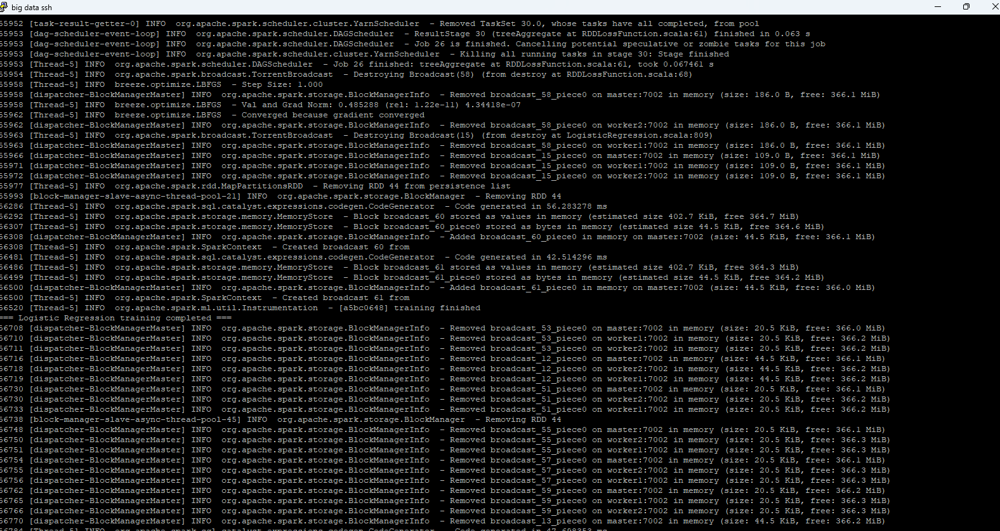
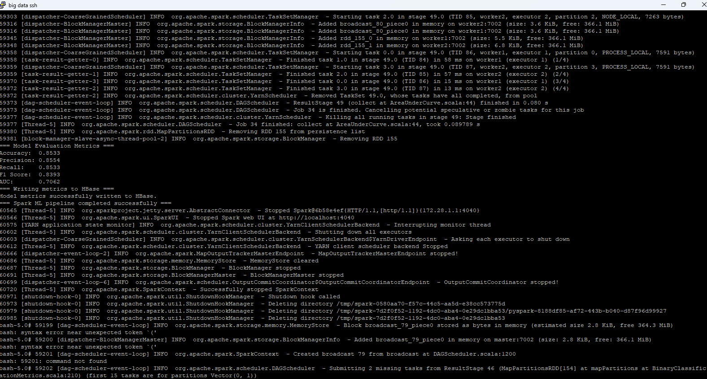
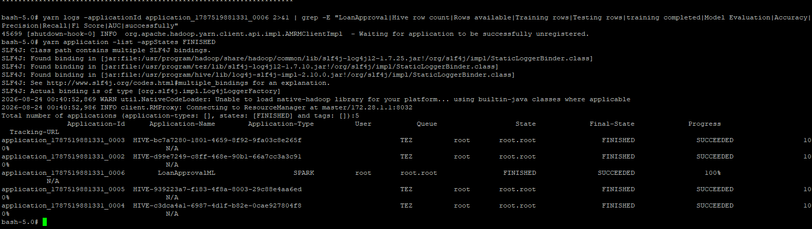

# Apache Spark MLlib — Distributed Machine Learning

## Role in the Pipeline

Apache Spark MLlib provides the distributed processing and machine learning layer for this project. The PySpark application reads project data from Hive, prepares the data for modeling, trains and evaluates a machine learning model, and generates model-performance metrics that are written into HBase.

## Hive Input

**Hive table:** `loan_approval`

Spark reads the Loan Approval Prediction dataset from the managed `loan_approval` Hive table. The machine learning workflow uses `applicant_income`, `coapplicant_income`, `loan_amount`, `loan_amount_term`, and `credit_history` as predictor features. The `loan_status` field is used as the target variable representing whether a loan application was approved.

## Data Preparation & Transformations

The PySpark application performs several preprocessing steps before model training. Relevant numeric predictor fields are selected from the Hive table, and `loan_status` is converted from its original `Y` and `N` values into a numeric binary label, where approved applications are represented by `1.0` and non-approved applications by `0.0`.

Records containing missing values in fields required by the machine learning model are removed. Spark MLlib's `VectorAssembler` combines the five numeric predictors into the `features` vector required by the model. The resulting dataset is then randomly divided into 70% training data and 30% testing data using a fixed seed of 42 for reproducibility.

## MLlib Algorithm

**Algorithm:** Logistic Regression

Logistic Regression was selected because loan approval is a binary classification problem. The model predicts whether a loan application will be approved based on the selected financial and credit-related attributes.

The predictor features are:

- `applicant_income`
- `coapplicant_income`
- `loan_amount`
- `loan_amount_term`
- `credit_history`

The target is the numeric label derived from `loan_status`.

## Training & Evaluation

The Logistic Regression model was trained on the training portion of the prepared dataset using Spark MLlib. The execution output confirmed that the optimization process converged and that model training completed successfully.

**Primary evaluation metrics:** Accuracy, Precision, Recall, F1 Score, and Area Under the ROC Curve (AUC)

The model produced the following results:

| Metric | Result |
|---|---:|
| Accuracy | 0.8533 |
| Precision | 0.8554 |
| Recall | 0.8533 |
| F1 Score | 0.8393 |
| AUC | 0.7062 |

The accuracy indicates that approximately 85.33% of the test predictions were correct. Precision, recall, and F1 provide additional measures of classification performance, while the AUC of approximately 0.7062 measures the model's ability to distinguish between the two loan-status classes across classification thresholds.

### Training Output



### Model Evaluation



## Spark Submit / YARN Execution

The PySpark application was submitted to the cluster through YARN using the following command:

```bash
spark-submit \
  --master yarn \
  --deploy-mode client \
  --name LoanApprovalML_to_HBase \
  analysis.py
```

The Spark application completed successfully through YARN. The YARN application listing showed the `LoanApprovalML` Spark application with a final state of `SUCCEEDED` and progress of `100%`. Spark tasks were distributed across the worker nodes during execution.



## HBase Output

After model evaluation, the PySpark application connects to HBase through `happybase` and the HBase Thrift server. The evaluation results are stored in the `loan_model_metrics` table using `logistic_regression_run1` as the row key and `metrics` as the column family.

Spark writes the following metrics to HBase:

- `metrics:accuracy`
- `metrics:precision`
- `metrics:recall`
- `metrics:f1`
- `metrics:auc`

This connects the machine learning stage to the final persistence layer by preserving the model evaluation results in HBase for subsequent retrieval and verification.

**PySpark source files:** [`processing.py`](processing.py) and [`analysis.py`](analysis.py)
